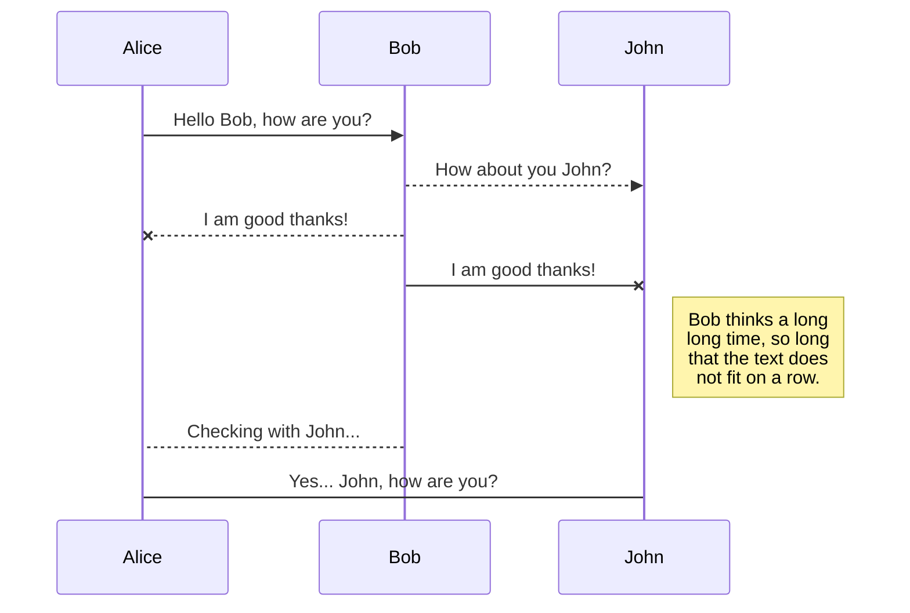
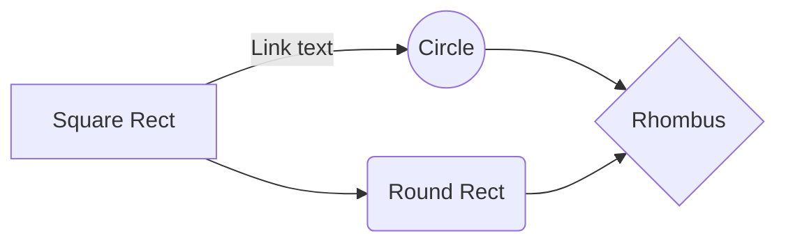

# 链接

1. 多个页面间链接@Typora=>Roam

相对路径：./1改变 自我意识 & 回归本质.md
绝对路径：F:\__两件事_三板斧\__Notes\000-笃行(躬身自省)\1改变 自我意识 & 回归本质.md


2. 页面内链接@Github

方法一：锚点 name或href

- 点击 [Project Overview](#Overview)

- 目标链接 <a name="Overview">Project Overview </a>

方法二：
<a href="地址" title="标题">内容</a>


3. 网页链接

[]()


- 图片title

鼠标移动图片上：img添加titile=""属性
链接：<a href="https://www.baidu.com" target="_blank">百度</a>


# 脚注

XXX [^num]


# UML图







# 进阶用法

## 快捷键

- 标题：ctrl + 数字
- ==表格==：ctrl + t
- ==生成目录==：`[TOC]`
- 选中一整行：ctrl + l
- 选中单词：ctrl + d
- 选中相同格式的文字：ctrl + e
- ==跳转到文章开头==：ctrl + home
- ==跳转到文章结尾==：ctrl + end
- 搜索：ctrl + f
- 替换：ctrl + h
- 下划线：ctrl + u
- 删除线：alt + shift + 5
- 插入链接：ctrl + k


## 文本属性

```css
<font face="黑体">黑体字</font>
<font face="STCAIYUN">我是华文彩云</font>

<font size=3> 字号3 </font> # 文本尺寸值：1-7

<font color=red> 红色字体 </font>
<font color=#8E236B> RGB 色号 #8E236B </font>

<table><tr><td bgcolor=orange> 背景色是：orange </td></tr></table>

<font face="黑体" size=12 color=#90EE90> 浅绿色黑体12字号 </font>

<table><tr><td bgcolor=orange><font face="黑体" size=6 color=#90EE90>浅绿色黑体尺寸6，背景色是：orange</font></td></tr></table>

<ruby>上标<rt>shang biao</rt></ruby>
```


# #参考文献

[Link: 官网|Mermaid](https://mermaid-js.github.io/mermaid/#/)

[Link: Typora进阶用法](https://ohlia.github.io/Wiki-site/wiki/Markdown/typora-edit-markdown-document/)


